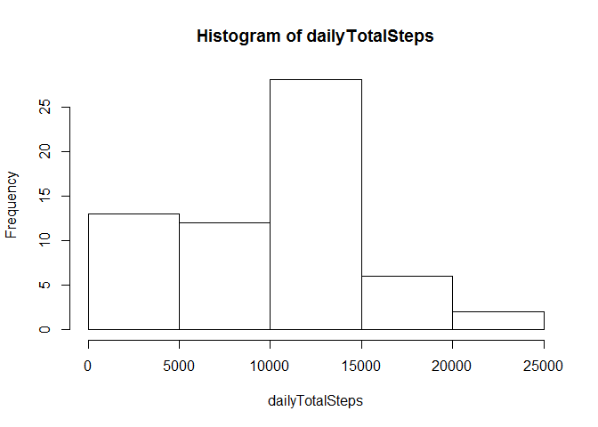
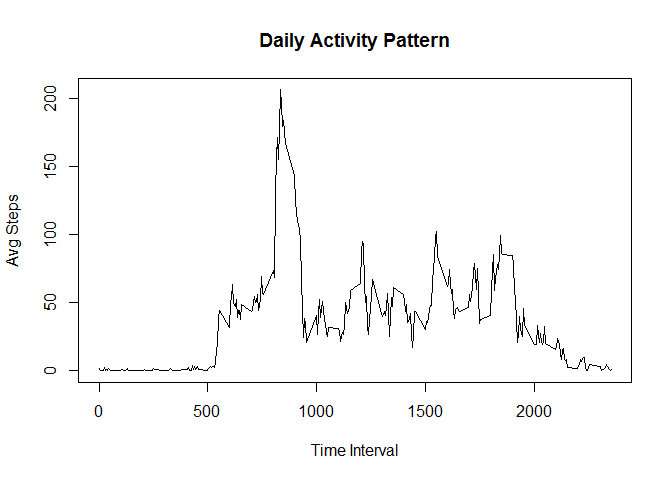
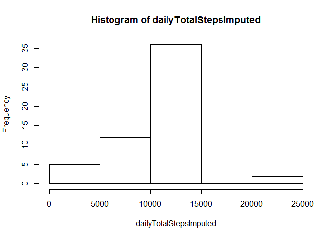
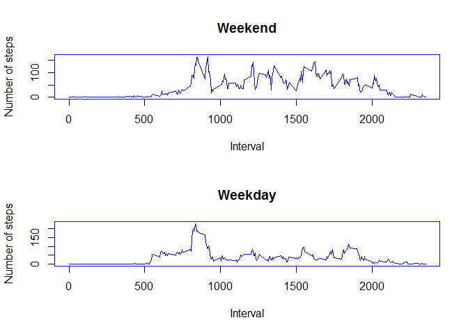

# Reproducible Research: Peer Assessment 1
Bob Currie  


## Loading and preprocessing the data


```r
## Read the comma-delimited data into a dataframe
activity <- read.csv("activity/activity.csv")

## convert steps to numeric
activity$steps <- as.numeric(activity$steps)
```


## What is mean total number of steps taken per day?

```r
## Calcualte total number steps taken each day
dailyTotalSteps <- tapply(activity$steps, activity$date, sum, na.rm = TRUE)

## Plot histogram of dailyTotalSteps
hist(dailyTotalSteps)
```



```r
##
mn <- mean(dailyTotalSteps, na.rm = TRUE)
med <- median(dailyTotalSteps, na.rm = TRUE)

print(mn) ## mean daily steps
```

```
## [1] 9354.23
```

```r
print(med) ## median daily steps
```

```
## [1] 10395
```


## What is the average daily activity pattern?

```r
## Calculate average number of steps per daily interval
dailyActivity <- tapply(activity$steps, activity$interval, mean, na.rm = TRUE)

## time-series plot with time intervals on the x-axis,
## avergage number of steps per interval on the y-axis
plot(names(dailyActivity),dailyActivity, type = 'l', xlab = "Time Interval", ylab = "Avg Steps")
title(main = "Daily Activity Pattern")
```



```r
## the interval with the max number of daily steps
print(names(dailyActivity[which.max(dailyActivity)]))
```

```
## [1] "835"
```

```r
print(max(dailyActivity))
```

```
## [1] 206.1698
```

## Imputing missing values

```r
 numMissing <- nrow(activity[is.na(activity$steps),])
 print(numMissing) ## number of missing values
```

```
## [1] 2304
```


```r
## Fill in the missing values with imputed values (create a new dataset)
## replace NAs with the mean number of steps for that interval
imputedActivity <- activity

## loop over the rows in the dataset
##if steps are missing (NA), replace with average steps for that interval (rounded)
for (i in 1:nrow(imputedActivity)) {
    if (is.na(imputedActivity[i,1])) 
        imputedActivity[i,1] <- round(dailyActivity[as.character(imputedActivity[i,3])])
}

## Calculate total number steps taken each day (imputed)
dailyTotalStepsImputed <- tapply(imputedActivity$steps, imputedActivity$date, sum)

## Plot histogram of dailyTotalStepsImputed
hist(dailyTotalStepsImputed)
```



```r
##
meanImputed <- mean(dailyTotalStepsImputed, na.rm = TRUE)
medImputed <- median(dailyTotalStepsImputed, na.rm = TRUE)

print(meanImputed) ## mean daily steps (imputed)
```

```
## [1] 10765.64
```

```r
print(medImputed) ## median daily steps (imputed)
```

```
## [1] 10762
```

We see the impact of imputing missing values. It smooths out the distribution of daily steps, resulting in a more normal distribution. The mean and median are now approximately equal, and slightly greater than before  

## Are there differences in activity patterns between weekdays and weekends?


```r
## Create a factor variable in imputedActivity to indicate "weekday" or "weekend"
imputedActivity$dayType <- c("weekday")

days <- weekdays(strptime(imputedActivity[,2], form = "%Y-%m-%d"))

for (i in 1:length(days)) {
    if (days[i] == "Saturday" | days[i] == "Sunday") imputedActivity[i,4] <- "weekend"
}

imputedActivity$dayType <- as.factor(imputedActivity$dayType)

## subset imputedActivity by dayType (weekend or weekday)
weekend <- subset(imputedActivity, dayType == "weekend")
weekday <- subset(imputedActivity, dayType == "weekday")

#Calculate average number of daily steps per interval
weekendActivity <- tapply(weekend$steps, weekend$interval, mean)
weekdayActivity <- tapply(weekday$steps, weekday$interval, mean)

## Panel plot of weekend and weekday actvity
par(mfrow = c(2,1), col = "blue")
plot(names(weekendActivity),weekendActivity, type = 'l',
     main = "Weekend",
     xlab = "Interval",
     ylab = "Number of steps")
plot(names(weekdayActivity),weekdayActivity, type = 'l',
     main = "Weekday",
     xlab = "Interval",
     ylab = "Number of steps")
```


